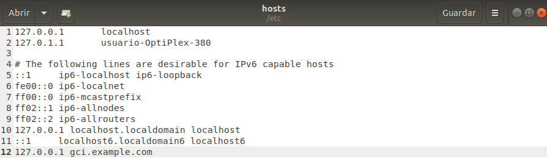

# **Apache**
Angel Hesse Caracena

## **Resumen**
En este documento hablaré sobre el servidor web **Apache**, sus origenes y como instalarlo y configurarlo.

## **Palabras Clave**
- Web
- Apache
- Servidor
- HTTP
- Dirección IP

## **Índice**
- Introducción
- Instalación de Apache
    - Más comandos que nos pueden servir
- Configuración de Apache
- Bibliografía

## **Introducción**
[Apache](https://dinahosting.com/ayuda/que-es-apache-y-para-que-sirve/) es un servidor web [HTTP](https://es.wikipedia.org/wiki/Protocolo_de_transferencia_de_hipertexto) de código abierto creado en 1996 y actualmente es el servidor web más usado en todo el mundo debido a sus seguridad y estabilidad que está desarrollado y mantenido por una comunidad de usuarios en torno a la [Apache Software Foundation](https://httpd.apache.org/docs/2.4/es/).

## **Instalación de Apache**
Para empezar abriremos un terminal, donde escribiremos `sudo apt-get update`, una vez hecho introducimos `sudo apt install apache2`.

Cuando acabe la instalación, configuraremos el cortafuegos, comenzaremos por listar las aplicaciones disponibles, solo nos interesa **Apache**. Para ello introducimos `sudo ufw app list` 

Y habilitamos apache con el comando `sudo ufw allow 'Apache'`

Realizamos un status para comprobar en qué estado se encuentra nuestro servidor con el comando `sudo ufw status`.

Con el comando `sudo systemctl status apache2`, sabremos si nuestro servidor se encuentra iniciado y habilitado.

Una vez haber comprobado que todo funciona correctamente, ponemos `hostname -I`, el cual nos dará nuestra **dirección IP** para introducirla en nuestro navegador y poder visualizar **Apache**.

Introducimos la **dirección IP** en nuestro navegador y comprobamos que vemos la pagina de apache.

Para terminar, introducimos el comando `sudo systemctl stop apache2` para parar el servidor, con esto habremos terminado la instalación de Apache.

### **Comandos útiles**
Iniciar el servidor Apache `sudo systemctl start apache2`.

Reiniciar el servidor `sudo systemctl restart apache2`.

Evitar que apache se inicie de forma automática `sudo systemctl disable apache2`.

Hacer que apache se inicie de forma automática `sudo systemctl enable apache2`.

## **Configuración de Apache**
Lo primero es crear una carpeta llamada **gci** en el directorio **/var/www/** con el comando `mkdir /var/www/gci/`.

Y comprobamos que está correcto con `cd /var/www/` y `ls`.

Una vez creada la carpeta, accedemos a ella `cd gci` y creamos un **index.html** despues `nano index.html` y escribimos el html:

```
<html>
    <head>
        <title>Ubuntu rocks!</title>
    </head>
    <body>
        <p>I'm running this website on an Ubuntu Server server!</p>
    </body>
</html>
```

Una vez hayamos guardado, nos dirigimos al directorio **/sites-available/**, situado en **/etc/apache2/** con el comando `cd /etc/apache2/sites-available/`.

Ahora copiamos el **.conf** a uno nuevo de la siguiente forma con el comando `cp 000-default.conf gci.conf`.

Cuando lo hayamos copiado, abrimos el nuevo archivo con nano para hacer los cambios pertinentes `nano gci.conf`.

Cambiamos el **DocumentRoot** a la ruta donde se encuentra nuestro archivo, y el **ServerName** al nombre que queramos poner en la barra del navegador.


A continuación, seleccionamos la nueva configuración como configuración principal escribiendo `a2ensite gci.conf`.

Después de activarlo, hay que reiniciar el servidor para aplicar los cambios con el comando `service apache2 reload`.

Entramos en la carpeta **/etc/** y modificamos el archivo **hosts** donde asociaremos nuestra **loopback** al **ServerName** que declaramos en el fichero anterior.



Escribimos el **ServerName** en nuestra barra del navegador y, si todo ha ido como debía, podremos observar nuestra web.

## **Bibliografía**
[Origen Servidor Apache](https://es.wikipedia.org/wiki/Servidor_HTTP_Apache)

[Install and configure Apache](https://ubuntu.com/tutorials/install-and-configure-apache#1-overview)

[Instalar el servidor web Apache en Ubuntu 20.04](https://www.digitalocean.com/community/tutorials/how-to-install-the-apache-web-server-on-ubuntu-20-04-es)
